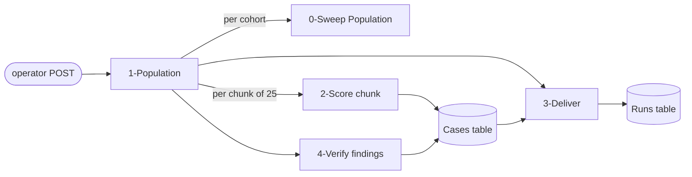
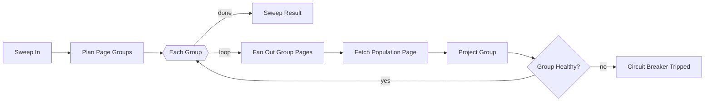
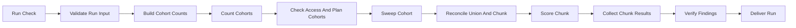
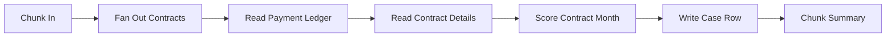
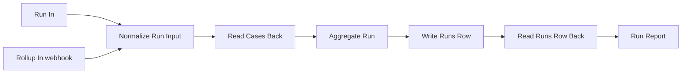
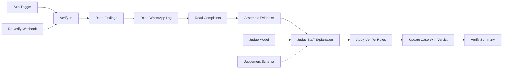

# Flows built for the MV Monthly Payment check

n8n instance `https://sami-team.app.n8n.cloud`, project **Adeeb** (`gxKXV4pckO4b4pQM`),
tag `audit: MV Monthly Pmt`. **All five are DRAFT — `active: false`, never published, never
scheduled**, and none holds an ERP credential: the token arrives in the run payload so every read
is attributable to whoever triggered the run.

| # | Flow | ID | Nodes | Entry |
|---|---|---|---|---|
| 0 | MV Monthly Payment · 0-Sweep Population | `9jOMFEC2zEWy2RHM` | 10 | sub-workflow, per cohort |
| 1 | MV Monthly Payment · 1-Population | `IKRXhIco1mwxrcPq` | 12 | **webhook** `/mv-monthly-payment-run` |
| 2 | MV Monthly Payment · 2-Score chunk | `CopNHNsXUzFO59bW` | 8 | sub-workflow, per chunk |
| 3 | MV Monthly Payment · 3-Deliver | `Z9fTvmaM526eYofe` | 9 | sub-workflow **+ webhook** `/mv-monthly-payment-rollup` |
| 4 | MV Monthly Payment · 4-Verify findings | `9T91z5VFH5g69WyT` | 14 | sub-workflow **+ webhook** `/mv-monthly-payment-verify` |

Stage 1 is the only one you start by hand. It calls 0, 2, 4 and 3 in that order.

Data tables: Cases `MlU50KCb0NEQC1ch`, Runs `5pArYsVWkARj2JXH` — both still named "…(test)",
which is worth renaming now that a real 8,925-contract result lives in them.

---

## 0 — Sweep Population  `9jOMFEC2zEWy2RHM`

Gentle paced sweep of ONE cohort. Built after a sweep of ~116 requests at `size=500`, 5 concurrent,
took the whole clientmgmt module to nginx 503.

- `pageSize` 100, **one request at a time**, paced — call count is not load, each `size=500`
  response carries 500 nested contract records.
- Two-pass pager: page 0 caps at 40 rows whatever `size` asks for, so the head pass must run at
  `size<=40` or offsets 40..S-1 are never requested.
- Projects slim immediately — a full sweep is ~45k rows, tens of MB raw.
- Returns contracts **only if** the sweep reconciled against `expectedTotal` within tolerance.
  A trip returns `aborted` with **no rows**: a partial population is never handed back.

*No node groups — the `splitInBatches` loop has two outputs and a loop-back, so no grouping of it
forms the single-entry/single-exit subgraph n8n requires.*

## 1 — Population  `IKRXhIco1mwxrcPq`

The orchestrator, and the only manual entry point.

Payload: `{ bearer, token, device, auditedMonth, offset?, limit?, runId?, contractIds?, chunkSize? }`

- Population = **ACTIVE ∪ CANCELLED-in-scope**. ACTIVE alone is a snapshot of today and misses every
  contract live in the audited month but cancelled since — which is how *both* of this check's first
  verified reds would have gone unreported. `CANCELLED` is not the filter value; it silently returns
  the ACTIVE cohort. The real one is `FILTER_CANCELED`, one L.
- `offset` + `limit` slice by ascending `contractId`; consecutive slices share one `runId`.
- Aborts rather than scoring a partial population.

## 2 — Score chunk  `CopNHNsXUzFO59bW`

One chunk of 25 contracts per sub-execution, so the parent never retains payloads. Returns
**counts only**.

- Scoring logic is byte-identical to `scorer.stage2.js`, which the offline suite runs against
  directly via `scorer.stage2.harness.js` — 84 scoring assertions against the copy that scores
  production, 147 against the canonical `scorer.js`. `build-stage2-node.sh` regenerates the node body.
- `Chunk Summary` is the **circuit breaker**: session-inactive trips on the first read, module
  unavailability and access denials on the third, plus a surface-storm backstop and a lost-rows
  assertion. It throws, which fails Stage 1's `Score Chunk` and stops the whole run.
- Ledger read reconciled against `totalElements` — an incomplete read is never trusted as a negative.

## 3 — Deliver  `Z9fTvmaM526eYofe`

- Reads the Cases table back as **ground truth** rather than trusting what Stage 2 returned, and
  reports `NOT REPORTABLE` unless every planned contract produced a case row.
- Counts **distinct by `case_key`**, so a slice resumed after a breaker trip cannot pass the
  completeness gate on its duplicates.
- `Rollup In` reports an existing run **with no ERP access at all** — added because a run can die
  mid-slice and Stage 1, the only other way in, always sweeps the ERP first.
- Emits counts, flags and totals only. Per-entity amounts and identifiers stay in Cases.

## 4 — Verify findings  `9T91z5VFH5g69WyT`

Runs only on cases the deterministic layer left as findings. Until it runs, **no finding is
PIL-ready**.

- **The sensitivity split is structural.** The WhatsApp log is read for **dates only** — message
  content and phone numbers never reach the case, the summary, or the model. Complaint text is what
  the model judges, and only a capped quote lands on the case.
- **Unknown never clears.** An unreadable surface or a model that fails to answer leaves the finding
  **standing** and blocks the PIL. Proven live: a dead Anthropic credential produced `v-down`, and
  the finding survived.
- `Re-verify Webhook` re-runs the verifier from the case store — 2 ERP calls per finding instead of
  the ~460 a population sweep costs. Use it when only the verifier changed.
- Asserts verdicts were persisted: an update that matched nothing used to end the chain silently,
  with the decisions computed and then lost.

---

## Also created, and cleaned up

`ZZ LLM credential probe` `KKmnKwkali2EL92Y` — one-call throwaway used to diagnose a dead Anthropic
credential without re-running 464 model calls. **Archived** after use.
